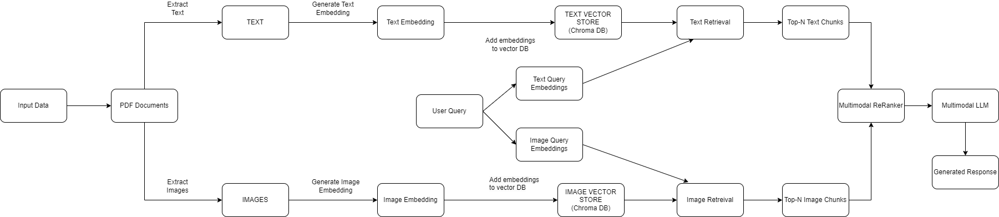

# Multimodal RAG
This project is a multimodal retrieval system that processes PDFs to extract text and images, generates embeddings using the CLIP model, stores these embeddings in ChromaDB, and allows retrieval based on user queries. The system supports both text and image queries and utilizes GPT-4 (via LangChain) to enhance text retrieval.



## Features
- Extract text and images from PDFs
- Generate text and image embeddings using CLIP (openai/clip-vit-base-patch32)
- Store embeddings and metadata in ChromaDB
- Retrieve relevant documents based on user queries (text and image queries)
- Utilize GPT-4 (via LangChain) for enhanced text-based retrieval
- Display retrieved text and images along with their similarity scores

## Requirements
Make sure you have the following installed:

- Python 3.8 or higher

- Required Python libraries:

```
pip install torch transformers PyMuPDF chromadb langchain PIL matplotlib
```

## Setup
### 1. Install Dependencies
### 2. Download the Pre-trained CLIP Model
The code uses the CLIP model for generating embeddings. Make sure the model is downloaded when running the script.
```
from transformers import CLIPProcessor, CLIPModel

device = "cuda" if torch.cuda.is_available() else "cpu"
model = CLIPModel.from_pretrained("openai/clip-vit-base-patch32").to(device)
processor = CLIPProcessor.from_pretrained("openai/clip-vit-base-patch32")
```

### 3. Configure API Keys
This project uses GPT-4 (via LangChain) to process text queries. You will need an OpenAI API key.

Add your OpenAI API Key in the code:
```
llm = ChatOpenAI(model="gpt-4o", openai_api_key="YOUR_OPENAI_API_KEY")
```

### 4. Project Structure

```
Main
│
├── pdfs/                  # Folder containing the PDF files to be processed
├── images/                # Folder where extracted images will be stored
├── chroma_db/             # Folder containing the embedded text and images
├── Readme.md              # Readme file
└── src/                   # Folder for code
```

### 5. Usage
#### i) Process PDFs and Generate Embeddings
#### ii) Retrieve Relevant Documents (Text & Image) Based on Query
#### iii) GPT-4 Retrieval Augmented Generation (RAG) for Text Queries
#### iv) Extract and Display Images from PDFs

### 6. Example Workflow
1. Place your PDFs in the ```pdfs/``` folder.
2. Run the script to process and store the embeddings.
3. Query the embeddings and retrieve relevant documents or images.
4. Optionally, use GPT-4 for enhanced responses.

### 7. Future Enhancements
- Support for Additional File Formats
- Optimizing Large-Scale Document Processing
- Advanced Image Processing
- Multilingual Support
- Integration with Cloud Services
- Real-Time Querying and Streaming
- Enhance the Retrieval with Visualizations
- Integration with Knowledge Graphs
- Ranking and Feedback-Based Search Improvement
- Cross-Modal Search (Text-to-Image, Image-to-Text)
